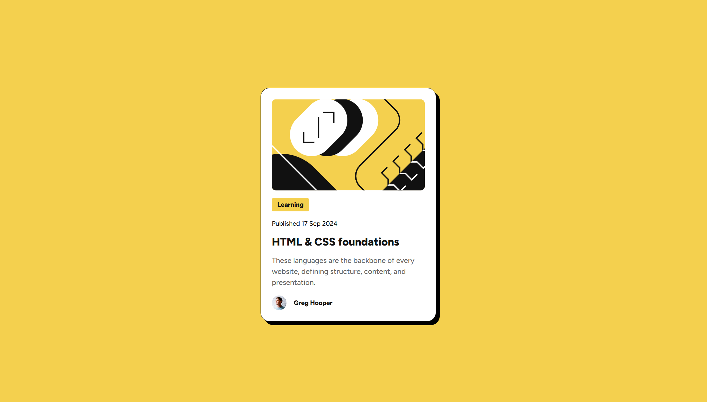
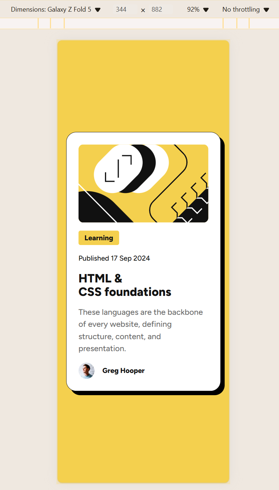

# Frontend Mentor - Blog preview card solution

This is a solution to the [Blog preview card challenge on Frontend Mentor](https://www.frontendmentor.io/challenges/blog-preview-card-ckPaj01IcS). 

## Table of contents

- [Overview](#overview)
  - [The challenge](#the-challenge)
  - [Screenshot](#screenshot)
  - [Links](#links)
- [My process](#my-process)
  - [Built with](#built-with)
  - [What I learned](#what-i-learned)
  - [Continued development](#continued-development)
- [Author](#author)

## Overview

### The challenge

Users should be able to:

- See hover and focus states for all interactive elements on the page

### Screenshot




### Links

- Solution URL: [My solution on Frontend Mentor](https://www.frontendmentor.io/solutions/responsive-blog-preview-card-using-flexbox-AfU_N1QBdJ)
- Live Site URL: [Blog preview card by Grimm-N](https://grimm-n.github.io/blog-preview-card/)

## My process

### Built with

- Semantic HTML5 markup
- CSS custom properties
- Flexbox
- CSS Grid

### What I learned

<h3>HTML</h3>
Now I see that I don't need to add every element into a separate <div> container. This way, I can create HTML code faster and more easily.

<h3>CSS</h3>
I also understand how helpful it is to use CSS Resets when working with styles. 
It creates the same spacing for all elements that have a subsequent element.

```
```I really like this part of CSS styles:
.card > * + * {
  margin-top: 1rem;
}
```

Additionally, I used only % and rem units, so I hope that will help make the design more responsive.


### Continued development

In future projects, I want to continue improving my skills with CSS Grid and Flexbox to create more complex and responsive layouts. Additionally, I plan to learn more about JavaScript to add interactive elements to my web pages. I also want to refine my use of CSS animations to make user interfaces more engaging.

Also, I want to focus on optimizing my projects for mobile devices. Currently, I believe this is one of the most important components of modern web development. My goal is to ensure that my websites are fully responsive and provide a seamless user experience across all screen sizes.

## Author

- Frontend Mentor - [@Grimm-N](https://www.frontendmentor.io/profile/Grimm-N)
